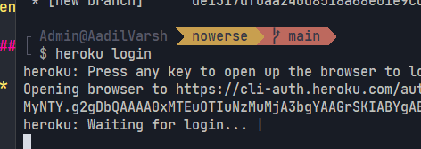
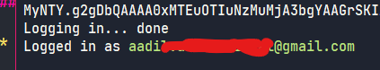
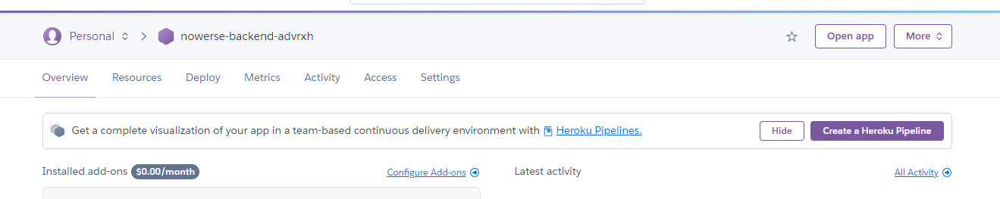
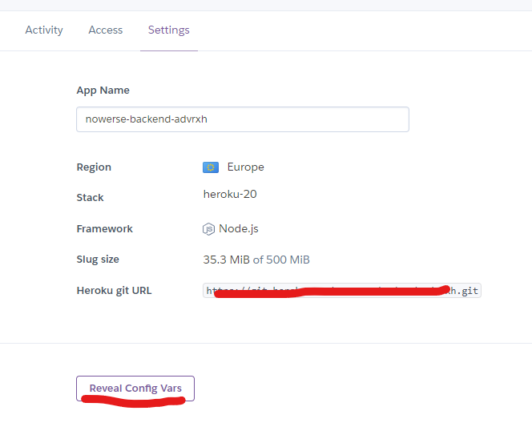
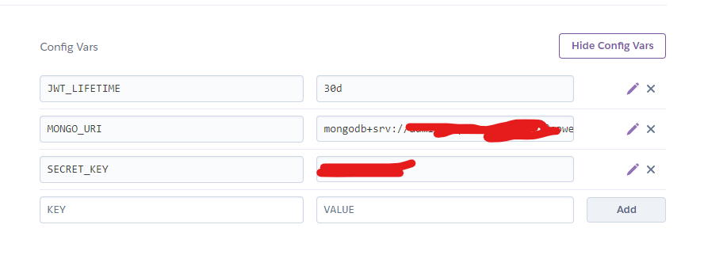
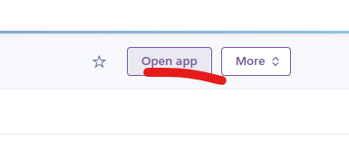

# Nowerse

## Backend deployment

I have made a few changes, also added new things, feel free to follow this and make the changes in your repository.

### Before deployment!

-   Added an `.env.example` file, it's for the people inspecting your repository, makes it easier for them to keep track of the envs

-   As I mentioned earlier on the meet, I've made some changes to the method types ( You can find them clearly mentioned in the commit messages )

-   I have added `PORT` environment variable support, because, hopefully backend should be deployed to heroku, so heroku doesnt allow you to choose your custom port, thus you are bound to the port you are assigned. They basically create a `PORT` env var in your instance which you can access

## Backend deployment!

-   ### Setting up heroku!
    -   Go to [heroku](https://heroku.com) and create an account!
    -   Install Heroku CLI from [here](https://devcenter.heroku.com/articles/heroku-cli)
    -   There are installation guide for all operating systems, follow the one you are currently on!
-   ### Creating a heroku app

    -   Open terminal and run

        ```bash
        heroku login
        ```

        this will open your browser and prompt you to login, follow the instructions and login!

    -   
    -   
    -   
    -   Now cd to your project directory `nowerse/`
    -   run
        ```bash
        heroku apps:create --region eu *name-of-your-app*
        ```

-   ### Before deployment

    -   Now visit [dashboard.heroku.com](https://dashboard.heroku.com) and you'll find your app there
    -   Open the app, it will open the app dashboard something like this
        
    -   Go to `Settings` tab and click on `Reveal Config Vars`
    -   Add every environment variable necessary for the app, except `PORT` which will be given by heroku
        
        

-   ### Deployment
    -   Create `Procfile` in `nowerse/backend` directory, please be careful, there is no extension for `Procfile` and yes, the **P** is in caps
    -   inside the Procfile add this
        ```
        web: node app.js
        ```
    -   Commit and push every changes to your github
    -   Afterwards, run this from your project root directory (i.e) `nowerse/`, **NOTE** : you are not pushing to github in this command you are pushing to heroku
        ```bash
        git subtree push --prefix backend heroku master
        ```
    -   That's it, now you can go to your heroku app dashboard, and open your app from here
        
